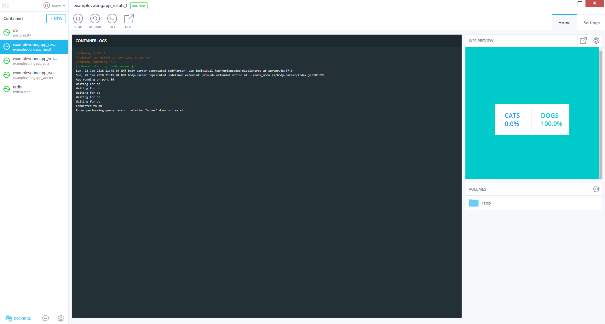

# CNAD Activity

### Links:

https://alm.accenture.com/jira/projects/CAIRRRMS/summary
https://alm.accenture.com/wiki/pages/viewpage.action?pageId=285554153

### Containerization Activity:
Ticket Link: https://alm.accenture.com/jira/secure/RapidBoard.jspa?rapidView=6997&projectKey=CAIRRRMS&view=detail&selectedIssue=CAIRRRMS-7

Target audience:
*  Developer or SysAdmin (2+ years experiance)
*  Completed PAAS Academy
*  Basic comandline knwoledge


Requirements:
*  Docker Toolbox (Includes Docker, Virtualbox and git) https://docs.docker.com/toolbox/toolbox_install_windows/
*  Code Editor e.g. VS Code https://code.visualstudio.com/


Content:

Start `Docker Quickstart Terminal`.

Note: If this does not work start `Git Bash` and start the following script `C:\Program Files\Docker Toolbox\start.sh`. The latter will setup docker and connect your Docker client with the Docker server, which runs in an virtual machine on VirtualBox.

Verify that Docker is setup correctly by typing `docker version` after which you should see something similar to this:
```
$ docker version
Client:
 Version:       18.01.0-ce
 API version:   1.35
 Go version:    go1.9.2
 Git commit:    03596f51b1
 Built: Thu Jan 11 22:29:41 2018
 OS/Arch:       windows/amd64
 Experimental:  false
 Orchestrator:  swarm

Server:
 Engine:
  Version:      18.01.0-ce
  API version:  1.35 (minimum version 1.12)
  Go version:   go1.9.2
  Git commit:   03596f5
  Built:        Wed Jan 10 20:13:12 2018
  OS/Arch:      linux/amd64
  Experimental: false

```

After this change into a directory of your desire where we will save all relavant files.
For this exersie we have to download a git project from GitHub. Do as follows in your directory:

````
git clone https://github.com/dockersamples/example-voting-app.git
$ cd example-voting-app/
````

Now we will execute docker-compose, which uses the `docker-compose.yml` file as a manifest for its execution.
````
$ docker-compose up
Creating network "examplevotingapp_front-tier" with the default driver
Creating network "examplevotingapp_back-tier" with the default driver
Creating volume "examplevotingapp_db-data" with default driver
Building vote
Step 1/7 : FROM python:2.7-alpine
2.7-alpine: Pulling from library/python
Digest: sha256:c0989b6c77d408476029a3f1776947f88674acfab9d2b9a6bf4b4a6235bcac3d
Status: Downloaded newer image for python:2.7-alpine
 ---> 0781c116c406
Step 2/7 : WORKDIR /app
[...]
````
After the execturion has executes you should be able to see that the docker images have been build and are running:
````
$ docker images
REPOSITORY                    TAG                 IMAGE ID            CREATED             SIZE
examplevotingapp_result       latest              6752a4b6701d        About an hour ago   81.8MB
examplevotingapp_worker       latest              bed73193aa00        About an hour ago   1.72GB
examplevotingapp_vote         latest              5a3fb4128370        About an hour ago   83.9MB
redis                         alpine              cb1ec54b370d        4 days ago          27.1MB
python                        2.7-alpine          0781c116c406        2 weeks ago         72.4MB
node                          8.9-alpine          7c2983dfbf98        2 weeks ago         68.1MB
postgres                      9.4                 92cb571ca65a        6 weeks ago         263MB
microsoft/dotnet              2.0.0-sdk           fde8197d13f4        3 months ago        1.64GB
kitematic/hello-world-nginx   latest              03b4557ad7b9        2 years ago         7.91MB

$ docker stats
CONTAINER ID        NAME                        CPU %               MEM USAGE / LIMIT     MEM %               NET I/O             BLOCK I/O           PIDS
01e8d0e5e511        examplevotingapp_worker_1   0.35%               29.26MiB / 1.955GiB   1.46%               8.35MB / 13.2MB     5.03MB / 0B         15
98c9c32a9747        db                          0.37%               5.266MiB / 1.955GiB   0.26%               7.91MB / 6.17MB     16.4kB / 41.5MB     8
f6b7c032cd19        redis                       0.10%               6.227MiB / 1.955GiB   0.31%               6.06MB / 2.77MB     2.5MB / 4.1kB       4
7937929bf19c        examplevotingapp_result_1   0.07%               44.16MiB / 1.955GiB   2.21%               1.72MB / 1.89MB     57.3kB / 4.1kB      20
895d6bfa7fae        examplevotingapp_vote_1     0.46%               28.55MiB / 1.955GiB   1.43%               18.5kB / 35.5kB     4.34MB / 0B         3
````

Also, if you open `Kitematic` a GUI for the Docker Toolbox you should be able to see your running setup including a web previeu of your application.


After we have played arround a bit with our application we may tear everything arround.
````
$ docker-compose down
Stopping examplevotingapp_worker_1 ... done
Stopping db                        ... done
Stopping redis                     ... done
Stopping examplevotingapp_result_1 ... done
Stopping examplevotingapp_vote_1   ... done
Removing examplevotingapp_worker_1 ... done
Removing db                        ... done
Removing redis                     ... done
Removing examplevotingapp_result_1 ... done
Removing examplevotingapp_vote_1   ... done
Removing network examplevotingapp_front-tier
Removing network examplevotingapp_back-tier
````

What we did:
*  Build 5 different Dockerimages
*  Instantiated those dockerimages and mounted local directories as volumes into some instances.
*  Setup a isolated network for thoes container instances.
*  Observed a running system.

TODO:
*  Explain Networking
*  Explain Structure Dockerfile
*  Explain Structure Docker compose file


Notes:

docker run komando auseinandernehmen.

Highlevel erklären.


Manuell die 5 Dockerfiles starten lassen.

 Docker file ausführen und lesen können.

 BEispiel Dockerhub best practice dockerfile

Volume
 Wie funktioniert das.


 application containter
 vs
 system container
 +++


 Docker run mit umgebungsvariablen.
 build
 delete img
 exec


 Wo landet es in der regestry   

 Example of how the docker image lifecicle works from dockerfile to deployment:
 Based on nginx


 192.168.99.100


 doc

# build and run docker image locally
 cd static-site
 docker images
 # no images
 docker build .
 # builds static site
 docker images
 # shows build image
docker images
REPOSITORY          TAG                 IMAGE ID            CREATED             SIZE
<none>              <none>              cdee46c56d9d        5 minutes ago       109MB
nginx               latest              3f8a4339aadd        6 weeks ago         108MB
# tag docker image
docker tag cdee46c56d9d  cnad:1.0
docker tag cdee46c56d9d  cnad:latest


docker build -t webserver-image:v1 .
docker run -d -p 80:80 webserver-image:v1
docker run -d --name my-production-running-app -e NODE_ENV=production -p 3000:3000 my-nodejs-ap
git


 # run image from hub.docker.io


 # clean everything up 
 docker system prune -a